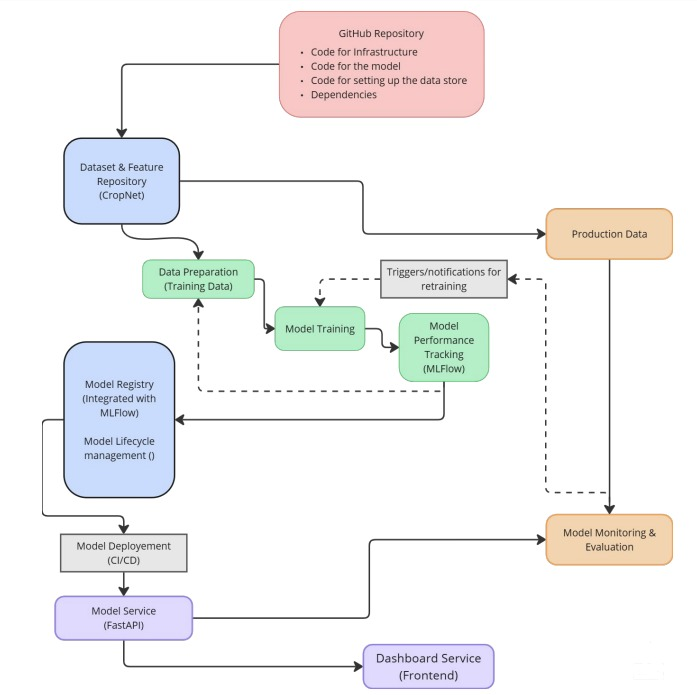

# AgriYield: A Cloud-Native MLOps System for Crop Yield Prediction
### Group 4

### Project Overview
**Value Proposition:** AgriYield aims to improve the accuracy of end-of-season crop yield predictions and provide **timely, data-driven forecast updates throughout the growing season** compared to traditional methods (heuristics, historical averages, manual analysis) used by agricultural planners, researchers, and related stakeholders. The system focuses on predicting **county-level yield variability** driven by weather and satellite-observed conditions, offering insights beyond static historical averages or lagged official reports. It leverages large-scale satellite imagery and weather data, primarily via the pre-processed CropNet dataset, combined with modern ML techniques within a robust MLOps framework.

**Status Quo:** Current methods often rely on USDA reports (which have lag), farmer surveys, historical county averages, or qualitative assessments. These are often slow to adapt to intra-season weather variations and emerging climate change impacts.

----

**Business Metric:**
1.  **Yield Prediction Accuracy:** Measured quantitatively by Root Mean Square Error (RMSE) and Mean Absolute Error (MAE) in yield units (e.g., bushels/acre) compared to actual USDA NASS county yields on held-out data (years/regions). 
2.  **Timeliness of Forecasts:** Measured by the time taken to generate and deliver updated yield forecasts to users (e.g., agricultural departments, cooperatives) compared to traditional methods. This includes the speed of processing incoming data and generating predictions.
3.  **User Engagement:** Measured by the number of active users accessing the system for yield predictions and updates, indicating the system's adoption and utility in real-world scenarios.

----
**Target Users:** Regional agricultural departments, farming cooperatives, commodity traders, agricultural researchers, and policymakers. The system enhances existing planning and analysis workflows. Some example of potential users include:
* **USDA NASS:** For accurate county-level yield estimates to inform agricultural policy and commodity markets.
* **Farmers and Cooperatives:** For real-time yield forecasts to optimize planting, harvesting, and resource allocation.
* **Commodity Traders:** For data-driven insights into crop supply and demand dynamics, aiding in trading decisions.
* **Agricultural Researchers:** For studying the impact of weather and climate on crop yields, supporting research in agronomy and climate science.

### Contributors

| Name                   | Responsible for                                      | Link to their commits |
| :--------------------- | :--------------------------------------------------- | :----------------------------------------------- |
| All team members       | Overall system design, integration, final reporting  |  |
| Saad Zubairi           | Model Training & Training Platforms (Units 4, 5)     |  [All commits](https://github.com/hurryingauto3/ece-gy-9183-mlops-project/commits/main/?author=saadhzubairi&since=2025-02-01&until=2025-05-11)|
| Ali Hamza              | Model Serving & Monitoring Platforms (Units 6, 7)    |  [All commits](https://github.com/hurryingauto3/ece-gy-9183-mlops-project/commits/main?since=2025-02-01&until=2025-05-11&author=hurryingauto3)|
| Armish Javed           | Data Pipeline (Unit 8)                               |  [All commits](https://github.com/hurryingauto3/ece-gy-9183-mlops-project/commits/main?since=2025-02-01&until=2025-05-11&author=armishjaved)|
| Garwith Luhadia        | Continuous X / DevOps (Unit 3)                       |  [All commits](https://github.com/hurryingauto3/ece-gy-9183-mlops-project/commits/main?since=2025-02-01&until=2025-05-11&author=luhadiagarvit)|

### System diagram

The diagram illustrates the system architecture deployed on Chameleon Cloud.

### Summary of outside materials

| Material             | How it was created                                                                                                                                                           | Conditions of use                                                                                                                  | Size |
| :------------------- | :--------------------------------------------------------------------------------------------------------------------------------------------------------------------------- | :--------------------------------------------------------------------------------------------------------------------------------- |------ |
| **CropNet Dataset** | Created by academic researchers [https://arxiv.org/abs/2406.06081]. Combines Sentinel-2, WRF-HRRR weather, and USDA NASS yields for ~2.3k US counties (2017-2022). | Open dataset for research. https://github.com/fudong03/CropNet |1 TB
| (Implicit) Sentinel-2 | ESA Copernicus Program satellite imagery.                                                                                                                                    | Free and open data policy, requires attribution to Copernicus.                                                                    |
| (Implicit) WRF-HRRR | Derived from NOAA's HRRR weather model, processed for CropNet.                                                                                                               | Underlying NOAA data is public domain.                                                   |
| (Implicit) USDA NASS Yields | Official US county yield statistics collected via surveys by USDA NASS.                                                                                              | Public domain (US Government work).                                                                                                |

| (Optional) SSURGO/gSSURGO | Soil data from USDA NRCS.                                                                                                                                            | Public domain. May be used to supplement CropNet features if needed.                                                               |
The CropNet dataset is the primary data source for this project. It provides a comprehensive set of features for training and evaluating the yield prediction model. The other datasets are used implicitly as part of the CropNet dataset. We may also consider using SSURGO/gSSURGO soil data to enhance the model's performance, but this is a necessary step.

----

## Summary of infrastructure requirements

| Requirement                                                     | How many/when                                                                                                                                                                                                                            | Justification                                                                                                                                                                                                                                                                                                                                                                                       |
| :-------------------------------------------------------------- | :--------------------------------------------------------------------------------------------------------------------------------------------------------------------------------------------------------------------------------------- | :------------------------------------------------------------------------------------------------------------------------------------------------------------------------------------------------------------------------------------------------------------------------------------------------------------------------------------------------------------------------------------------------------ |
| `m1.large` (or similar CPU VMs)                                 | 1 "services_node" VM (flavor `m1.large`) provisioned by Terraform (`chameleon_devops/terraform/main.tf`).                                                                                                                               | Acts as the primary host for the Kubernetes (K3s) control plane and potentially worker node functionalities. Ansible playbooks (`chameleon_devops/ansible/`) are used for its setup. It subsequently runs core services like MLflow, the Dashboard, and other non-GPU intensive application components deployed via Kubernetes manifests (`chameleon_devops/k8s/`). This consolidates multiple logical roles onto one VM. | 
| `gpu_a100` / `gpu_mi100` (or available GPU type from Chameleon lease) | 1 "gpu_node" VM (flavor `baremetal`, specific type via Chameleon lease ID `gpu_reservation_id`) provisioned by Terraform (`chameleon_devops/terraform/main.tf`). Estimated usage: ~24-32 GPU-hours/week during active training phases.   | Dedicated resource for computationally intensive model training and potentially GPU-accelerated inference tasks. The specific GPU type is determined by the Chameleon baremetal lease. Ansible may also configure this node, and it can be added to the K8s cluster as a GPU-enabled worker.                                                                                                        |
| Floating IPs                                                    | 2 Floating IPs provisioned by Terraform (`chameleon_devops/terraform/main.tf`): 1 for `services_node`, 1 for `gpu_node`.                                                                                                                     | Provides stable, direct SSH access to the `services_node` (K3s master/main node) and the dedicated `gpu_node`. External access to user-facing applications (Dashboard, MLflow UI, Model Serving API) is typically managed via a Kubernetes Ingress controller deployed on the `services_node`, utilizing its Floating IP.                                | 
| Persistent Storage                                              | Persistent block storage volumes are attached by Terraform (`chameleon_devops/terraform/main.tf`) to both the `services_node` and `gpu_node`. The project estimates a total need of ~2 TB.                                                | Essential for storing the large CropNet dataset (~1TB+), MLflow artifacts (models, experiments), Kubernetes persistent volume claims (PVCs) for stateful services (e.g., Prometheus data), container image layers, and logs. The ~2TB is an overall project requirement; specific volume sizes are managed by OpenStack defaults or direct configurations if not in Terraform variables. | 

---

## Detailed design plan

### Model training and training platforms

> Strategy

We implemented a multi-branch deep learning model for county-level crop yield prediction using structured weather time-series and categorical inputs (county FIPS, crop type). The model combines an LSTM and TCN stack, with learned embeddings for both region and crop. It predicts per-crop yield across counties using high-frequency weather data from CropNet. Built in PyTorch.

> Infrastructure

Training occurred in a containerized Jupyter environment on a GPU-enabled Chameleon Cloud bare-metal node. PyTorch handled model training; MLflow was used for experiment tracking, versioning, and stage transitions (None → Staging → Production). Jobs were launched via CLI or Jupyter. GPU acceleration used Docker's `--gpus all` and CUDA-enabled PyTorch.

> Justification

The LSTM+TCN hybrid balances memory and temporal convolution power. FIPS and crop embeddings adapt predictions by location and type. MLflow provides reproducibility and MLOps-aligned deployment (e.g., stage transitions).

> Lecture Link

Aligns with Unit 4 (Modeling, Training at Scale, GPU usage) and Unit 5 (MLflow, Registry, Promotion, Notebook/Script Training).

> Specifics

Tracked RMSE/MAE per model version. MLflow logged hyperparameters, training time, and evaluation metrics. Model trains in under 1 minute on an A100 GPU. Predictions are crop-specific; the model generalizes to others via retraining.

---

> Unit Requirements Met

- **Unit 4:** Training/retraining implemented; modeling justified; supports both scripts and notebooks
- **Unit 5:** MLflow experiment tracking on Chameleon; model promotion; containerized reproducibility

---

#### Unit 4 & 5 Walkthrough Summary

> Modeling
- **Inputs:** Daily weather features (temperature, precipitation, humidity, radiation, etc.) and categorical identifiers (FIPS code, crop type)
- **Output:** Crop yield (bushels/acre) per crop, county, year
- **Model:** LSTM + TCN with learned embeddings. Chosen for modularity and success in prior time-series literature.

> Train and Retrain
- Triggered via `01_control_centre.ipynb` or `train.py`, controlled by config dict
- MLflow logs all runs, parameters, metrics
- `train.py` supports non-interactive retraining with pre-mounted data
- Model is saved and registered to MLflow after each run

> Experiment Tracking
- MLflow (Docker Compose stack) logs metrics, artifacts, and hyperparameters
- Run comparisons via MLflow UI
- Model promotion via `promote_model.py`, with registry stage transitions tracked

> Scheduling Training Jobs
- Manual: Jupyter notebook or `docker compose run model-training`
- Configurable via `.env.jupyter`
- GPU-backed runs via `--profile gpu` with Jupyter container support

> Optional (Distributed / Large Model Strategy)
- Jupyter container deployed to GPU-backed Chameleon nodes
- Setup supports future use of DDP, FSDP, or Ray Train for scalable training or tuning
---------
---
#### Model serving and monitoring platforms

1.  *Strategy:* We deploy the trained model using FastAPI as a REST API, packaged with Docker, and run it on a Kubernetes cluster. After training, we evaluate the model using standard metrics and monitor its performance over time.
2.  *Diagram Parts:* FastAPI Model Service, Docker containers, CI/CD pipeline, Monitoring scripts, Model Registry, Dashboard for results.
3.  *Justification:* This setup is easy to scale, follows modern cloud practices, and helps keep the model up to date and reliable.
4.  *Lecture Link:* Covers Unit 6 (model deployment with API, containerization) and Unit 7 (basic evaluation and monitoring after deployment).
5.  *Specifics:*
    *   **Core Components & API:**
        *   The main model serving logic resides in the `model_serving/` directory.
        *   `model_serving/app.py`: Implements the FastAPI application. It defines the primary API endpoints:
            *   `/predict`: Accepts a county FIPS code, year, cut-off date, crop type, and desired histogram bins. It orchestrates feature retrieval, model inference, and returns a predicted yield histogram.
            *   `/health`: Provides a health check endpoint to verify the service status and its dependencies.
            *   `/model_info`: Returns details about the ML model currently loaded by the service (e.g., name, stage from MLflow or dummy status).
        *   `model_serving/predict.py`: Contains the core prediction workflow, including fetching features from the Feature Service, preparing tensors for the model, executing model inference, and formatting the output histogram.
        *   `model_serving/schemas.py`: Defines Pydantic models for request and response validation, ensuring data integrity at the API boundary.
    *   **Model Loading & Fallback to Dummy Mode:**
        *   `model_serving/mlflow_loader.py`: This module is responsible for loading the trained model (e.g., `LSTMTCNHistogramPredictor`) and its associated mappings (FIPS codes, crop types to IDs) from an MLflow Model Registry.
        *   A key feature is its **graceful fallback mechanism**. If the MLflow server is unavailable, or if the specified model/artifacts cannot be loaded, the service automatically defaults to using a `DummyLSTMTCNHistogramPredictor` (defined in `model_training/model.py`). This ensures service availability for testing and development even without a live MLflow backend.
    *   **On-the-Fly Dummy Asset Generation:**
        *   The `model_serving/entrypoint.sh` script is executed when the Docker container starts.
        *   It calls a script originally from `model_training/generate_dummy_assets.py` (copied into the container as `/app/asset_generator_tools/generate_assets.py`), which creates the necessary dummy model state file (`dummy_model_state.pth`) and dummy mapping files (`fips_to_id_mapping.json`, `crop_to_id_mapping.json`) directly within the container (typically in `/app/dummy_assets`).
        *   This internal generation ensures that the fallback mechanism works seamlessly without needing pre-existing dummy files to be mounted from the host system.
    *   **Containerization & Configuration:**
        *   The service is containerized using `model_serving/Dockerfile`. This Dockerfile sets up the Python environment, copies the application code (including the asset generation tools from `model_training/`), and defines the `entrypoint.sh` as the startup command.
        *   Configuration parameters (MLflow URI, Feature Service URL, dummy mode flags, paths to dummy assets like `MLFLOW_DUMMY_MODEL_PATH`) are managed via environment variables. These are set in Docker Compose files (`docker-compose.yml`, `docker-compose.dummy.yml`) and can be customized further using `.env` files.
    *   **Performance Goals & Basic Monitoring:**
        *   The service aims for a sub-2-second response time for single predictions and targets support for at least 10 concurrent users.
        *   Model accuracy is evaluated post-training using standard metrics (RMSE, MAE, R²).
        *   The service includes a *framework* for basic data drift detection (`model_serving/drift.py`) by logging predictions for offline analysis. The core drift detection logic (`check_data_drift`) is currently a placeholder and would require implementing baseline statistics. Seasonal performance checks are planned.
        *   Basic API load testing has been implemented using Locust. Locust is configured as a separate Dockerized service (`locust-service` in `docker-compose.yml` under a "testing" profile) with its test definitions in `locust/locustfile.py`. It simulates concurrent users against the `/predict` (model-serving) and `/features` (feature-serving) endpoints, helping to identify performance characteristics under load.

6.  *Unit Requirements Satisfied:* Unit 6: API for serving, Docker/K8s deployment; basic load testing (implemented with a dedicated Dockerized Locust service `monitoring/locust.py`), simple monitoring (Prometheus Grafana operational metrics). Feedback loop (logging for future drift/performance analysis) is not implemented.

7.  *Difficulty Points Attempted:* *Unit 7: Monitor for data drift.* The system includes the initial framework for data drift monitoring by logging prediction inputs and outputs, with placeholder functions for actual drift detection logic.

The full README for the model serving component is available [here](model_serving/README.md).

#### Data pipeline

1.  *Strategy:* We store the CropNet dataset on Chameleon's persistent storage and access it during training and evaluation. We simulate online data access with a script that fetches features based on county and year. A simple dashboard will help us visualize the data and model predictions.
2.  *Diagram Parts:* Persistent Storage, Docker containers running training or data services, DataLoader code, Feature fetch script, Dashboard service.
3.  *Justification:* Handling a large dataset like CropNet requires fast and reliable storage and loading. The online simulation checks that the model can retrieve the right features, and the dashboard makes the data easier to understand and debug.
4.  *Lecture Link:* Covers Unit 8 (Storage on Chameleon, ETL/loading for training, simulating online data access).
5.  *Specifics:* Dataset is around 1TB. We load batches from storage during training. The online script returns features for a given county and date. The dashboard lets users explore inputs and compare predicted vs. actual crop yield.
6.  *Unit Requirements Satisfied:* Unit 8: Persistent storage, offline data access with DataLoaders, online data simulation, basic ETL defined.
7.  *Difficulty Points Attempted:* *Unit 8: Interactive data dashboard.*

#### Continuous X

1.  *Strategy:* Infrastructure (VMs, storage) are be defined as code (Terraform + Ansible). Application configurations (Kubernetes manifests, service settings) will also be stored in Git and automatically applied to the K3s cluster. CI (using ArgoCD) will handle testing and building Docker images. CD/CT will automate the end-to-end process: triggering training and retraining, evaluating, registering models in MLflow, deploying the API server to staging, running tests, and simulating promotion through canary to production environments, adhering to immutable infrastructure principles.
2.  *Diagram Parts:* Git Repo (GitHub), CI/CD Tools (ArgoCD Workflows), Cron Jobs, Container Registry, K8s Cluster (Staging/Canary/Prod namespaces), Ray Cluster, MLflow Server.
3.  *Justification & Lecture Link (Unit 3):* This implements a fully automated, reproducible MLOps workflow using IaC, GitOps, CI/CD/CT pipelines, containerization, and staged deployments, directly applying the core DevOps and cloud-native principles from Unit 3.
4.  *Specifics & Requirements:* Terraform defines infra. Ansible playbooks define roles and tasks, Kubernetes YAML scripts define apps. This satisfies **Unit 3** (IaC, Cloud-native principles, CI/CD/CT pipeline, Staged deployment).
5.  *Difficulty Points Attempted:* 
    1.  *Unit 1: Composed of multiple models.* (The system design inherently supports multiple interacting models - yield predictor, potentially recommender, integrated and managed via this Continuous X pipeline).

    2.  Unit 3 (DevOps): CI/CD and continuous training: The system has an automated pipeline that, in response to a trigger (a daily schedule, or an external condition), calls the retraining cron-workflow to re-train our model, runs the complete offline evaluation suite, and deploy it to a staging area for further testing (load testing via locust swarm).

**A more detailed walkthrough of this is shown in [the setup guide to Infrastructure on Chameleon Cloud](chameleon_devops/README.md), which clearly outlines the steps and commands needed to run to automate the resource allocation, provisioning and initialization.**

| Port | Service              | Role in This Project                                                                                 |
|------|----------------------|-------------------------------------------------------------------------------------------------------|
| 5000 | MLflow               | Experiment tracking and model registry for all training runs; CI/CD pipeline registers/promotes models here. |
| 3000 | Grafana              | Live dashboards displaying metrics collected by Prometheus (system health, model latency, drift alerts). |
| 9090 | Prometheus           | Scrapes metrics from Kubernetes pods, FastAPI, Ray, and MLflow; feeds alerts & dashboards.            |
| 9000 | MinIO                | S3‑compatible object store holding datasets, training artifacts, and exported model binaries.         |
| 9001 | MinIO Console        | Web UI to manage MinIO buckets / objects (data snapshots, model checkpoints).                         |
| 8000 | FastAPI              | Online inference endpoint serving the latest canary/production model images.                         |
| 8265 | Ray Dashboard        | Monitoring UI for the Ray cluster that runs distributed training, hyper‑parameter searches, and ETL. |
|10001 | Ray Client           | Remote client port for developers / CI jobs to submit Ray tasks to the cluster.                       |
| 8501 | DataViz Dashboard    | Custom Streamlit/Gradio UI for interactive exploration of predictions and error analysis.            |
| 80   | Argo CD HTTP         | GitOps web interface to visualize Kubernetes deployment state and promotion pipelines.                |
| 443  | Argo CD HTTPS | Secure API endpoint used by ArgoCD to sync and promote manifests across staging/canary/prod. |
| 8089 | Locust Swarm         | Generates load against FastAPI to validate autoscaling targets and regression performance.            |

All major components are included: a managed Kubernetes cluster  hosting model training and serving containers, a Docker/OCI registry for container images, an MLflow server for experiment tracking, and monitoring tools (Prometheus/Grafana and Locust Swarm) collecting data and model performance. The pipeline orchestration runs on ArgoCD, which integrates with the repository (code, data versioning) and triggers automated jobs.